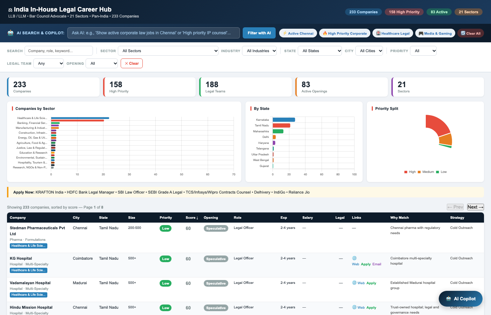
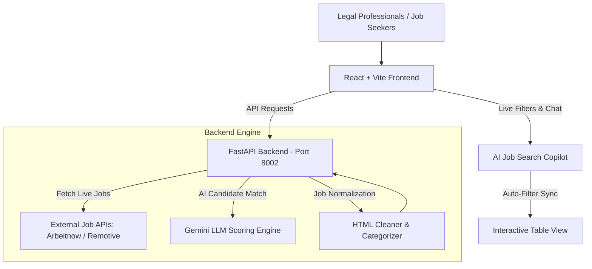

# ⚖️ LegalJobs AI Assistant & Career Intelligence Agent

LegalJobs is an intelligent vertical SaaS platform designed for the legal industry. It combines a specialized live job marketplace with an **AI-powered Job Search Copilot**, Candidate-Job Fit scoring engine, and interactive analytics dashboard. The platform helps lawyers, paralegals, and legal professionals find active career opportunities in real time.

---

## 📸 Platform Capabilities & Screenshots

Here is what the platform delivers:

### 1. Live Job Marketplace Dashboard
Interactive table view with real-time job listings from live APIs, complete with practice area badges, seniority tags, company details, and location filters.


---

### 2. Interactive AI Job Search Copilot
Job seekers can search using natural language (e.g. *"Show active corporate law jobs in Chennai"*). The AI Copilot parses intent and **automatically updates and filters the main table view** live, while providing personalized career tips.



---

### 3. India In-House Legal Career Hub
Comprehensive target company catalog with 200+ listed entities, legal team verification, sector distribution charts, and priority scoring.


---

## 🏛️ Key Features

### 1. 🤖 AI Job Search Copilot
- **Live Table Sync**: Typing commands in the Copilot chat automatically filters the table, updates summary statistics, and highlights top matches.
- **Natural Intent Parsing**: Parses location (`Chennai`, `Bangalore`, `Remote`), practice area (`Corporate`, `Compliance`, `IP`, `Privacy`), and seniority.
- **Suggested Quick Chips**: One-click action chips (`⚡ Active Chennai`, `🔥 High Priority`, `🏥 Healthcare`, `🔄 Reset`).

### 2. 🌐 Real-Time Live Job Aggregator
- **Live API Integration**: Fetches active job postings from public job board APIs (`Arbeitnow`, `Remotive`).
- **Auto-Categorization**: Automatically cleans HTML descriptions and maps roles into practice areas (*Corporate & Commercial*, *Compliance & Regulatory*, *Intellectual Property*, *Data Privacy*, *Litigation*).
- **Timezone-Aware Filtering**: Robust date parsing and offset-aware UTC filtering.

### 3. 🎯 Candidate-Job Fit Scoring Engine
- **LLM Matching**: Backend LLM endpoint (`POST /match`) generates an AI relevance score (0–100) comparing candidate skills and experience against job requirements.

---

## 🏗️ Architecture Overview



---

## 🛠️ Technology Stack

- **Frontend:** React 18, TypeScript, Vite, Custom CSS (Mirroring `index.html` design system)
- **Backend:** FastAPI (Python 3.11+), Uvicorn, HTTPX Async Client, Pydantic
- **AI Inference:** Google Gemini API (`google-generativeai`)
- **Documentation & Testing:** Headless Chrome screenshot automation, Pytest / Curl

---

## 🚀 Getting Started

### Prerequisites
- Python 3.10+
- Node.js 18+

### 1. Clone the Repository
```bash
git clone https://github.com/kiru6006/legal-jobs-agent.git
cd legal-jobs-agent
```

### 2. Start the Backend API (FastAPI)
```bash
# Create and activate virtual environment
python3 -m venv .venv
source .venv/bin/activate

# Install dependencies
pip install -r backend/requirements.txt

# Run backend server on port 8002
uvicorn backend.app.main:app --reload --host 0.0.0.0 --port 8002
```

### 3. Start the Frontend (Vite + React)
```bash
cd frontend
npm install
npm run dev
```
Access the frontend application at **http://localhost:5173** (or http://localhost:3000).

---

## 📡 API Endpoints Reference

| Method | Endpoint | Description |
| :--- | :--- | :--- |
| `GET` | `/` | Health check endpoint |
| `GET` | `/jobs?days=30` | Returns live legal jobs filtered by past *N* days |
| `GET` | `/jobs/external` | Live aggregated external jobs feed |
| `POST` | `/match` | Evaluates candidate JSON against a job ID and returns relevance score (0–100) |

---

## 📂 Project Structure

```
legal-jobs-agent/
├── backend/                    # FastAPI backend
│   └── app/
│       ├── main.py             # Live API job aggregator & FastAPI routes
│       ├── ai.py               # Gemini LLM candidate-job matching
│       ├── models.py           # Pydantic schemas
│       └── database.py         # DB connection module
├── frontend/                   # React + Vite frontend
│   ├── src/
│   │   ├── components/
│   │   │   ├── JobsList.tsx    # Table view with AI Copilot integration
│   │   │   ├── JobsList.css    # Modern UI styles mirroring index.html
│   │   │   └── CandidateMatch.tsx
│   │   ├── App.tsx             # Main layout component
│   │   └── main.tsx
│   └── package.json
├── docs/
│   └── screenshots/            # Product screenshots
│       ├── dashboard_live_marketplace.png
│       ├── ai_copilot_assistant.png
│       └── legal_career_hub_india.png
├── index.html                  # Standalone India Legal Career Hub with Copilot
└── README.md                   # Primary documentation
```

---

## 🤝 Contributing

Contributions are welcome! Feel free to open issues or submit Pull Requests to enhance the legal AI features.

---

## 📄 License

This project is licensed under the MIT License.